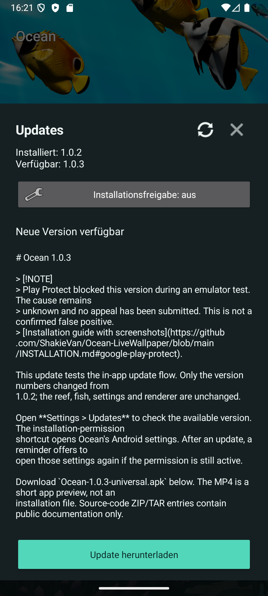
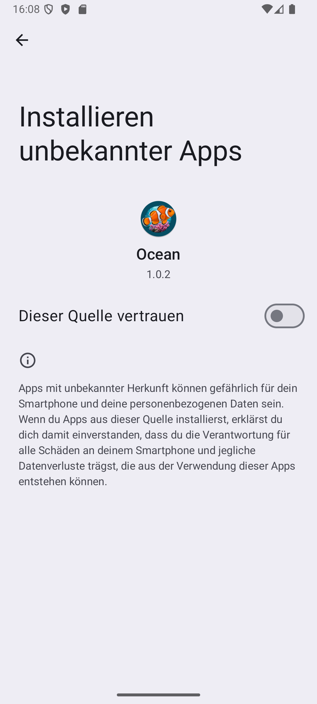
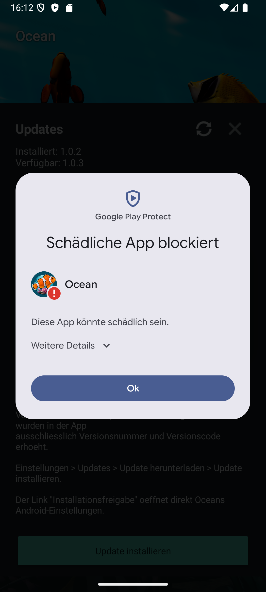
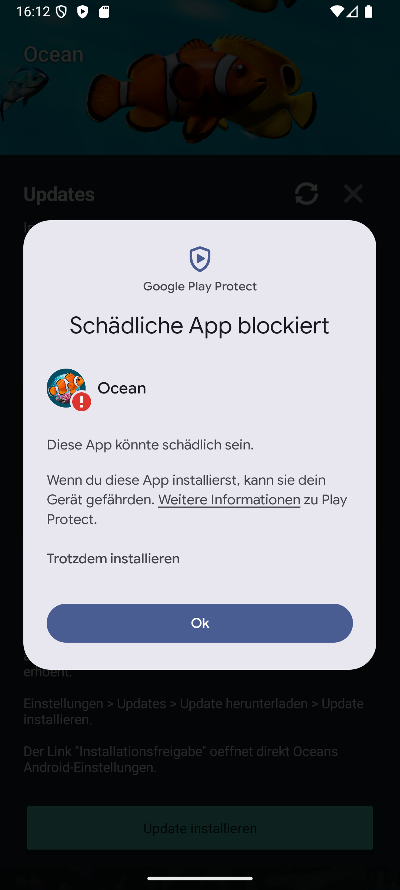

# Installing and Updating Ocean

Ocean is distributed as an APK through this repository, outside Google Play.
Download only from [Ocean Releases](https://github.com/ShakieVan/Ocean-LiveWallpaper/releases).
The universal APK works across the supported phone architectures.

## First Installation

1. Download the APK and open it from your browser or Downloads.
2. If Android requests permission for that source, open its **Settings** link.
   Enable **Allow from this source** only for the app that is opening the APK.
3. Return to the installer and read any security messages before continuing.
4. After installation, you can turn the source's installation permission off again.

Permission to install APKs and a Play Protect scan are separate checks. Granting
the first does not mean Google has approved the app.

## Updates Inside Ocean

1. Open **Settings > Updates** (`Einstellungen > Updates` in the current app).
2. Check the available version and release notes, then choose **Download update**.
3. Choose **Install update**. If needed, **Installation permission**
   (`Installationsfreigabe`) opens Android's settings specifically for Ocean.
4. Return to Ocean and start the installation. Android asks for confirmation.
5. On first opening after an update, Ocean offers a settings link if its
   installation permission is still active, so you can switch it off again.

For the first download, the permission belongs to your browser or file manager;
for an in-app update it belongs to Ocean. Turning off Ocean's permission does not
turn off your browser's permission.

## Google Play Protect

> [!NOTE]
> During our September 13, 2026 emulator test, Play Protect blocked **1.0.3**
> with `POTENTIALLY_UNWANTED / generic_malware`. The scan did not identify a
> specific file or behaviour. We have not established the cause or a false
> positive. An appeal was submitted on September 13, 2026, and Google confirmed
> receipt, but no decision has been communicated. Version 1.0.2 has almost identical
> code, so it should not be treated as an independently cleared alternative.

The unchanged 1.0.3 APK was uploaded to VirusTotal with the owner's consent.
Its [September 13 report](https://www.virustotal.com/gui/file/4591edc13eeb30c1aeaca974bb541c8e6b026a1593933678c6c7cd28ed3ab172)
showed **0/67 detections**, including Google "Undetected". Seven other engines
could not process the file type and one failed; those do not count as clean checks.
This is additional evidence, not an exhaustive security audit or confirmation that
on-device Play Protect has changed its result. The appeal included the scan result.
That report is for the exact 1.0.3 APK. It is not a scan of 1.1.0, and no Play
Protect clearance for 1.1.0 is claimed here.

This is different from a message that merely says an app is unfamiliar or asks
to scan it. It is not known to be caused by small download numbers, a missing
registration or unpaid Google fees.

### Reading the Dialog

These are real screenshots from an Android emulator in German. Your phone's
wording and layout may differ.

- **More details** (`Weitere Details`) expands the explanation; it does not install.
- **OK** (`Ok`) closes the blocked-installation dialog without installing the update.
- The expanded panel may offer **Install anyway** (`Trotzdem installieren`).
  That overrides this installation block; it is not a successful security check
  or Google approval. Our test did **not** select it. We recommend leaving the
  block in place while the classification remains unresolved.

Do not disable Play Protect globally to install Ocean. If the dialog only asks
for a scan, let the scan finish and read its result; do not assume it will be
the same as a result on another device or version.

Google's [developer guidance](https://developers.google.com/android/play-protect/warning-dev-guidance)
describes the different messages and the [classification appeal process](https://support.google.com/googleplay/android-developer/contact/protectappeals).
Developer identity verification is a separate process, not automatic clearance
of a malware classification.

### File Integrity

The updater checks the GitHub asset digest, file size, application identity,
newer version and matching signing certificate before opening Android's installer.
For a manual download, each release includes `SHA256SUMS.txt`.
These checks establish identity and integrity, not that an APK is harmless.

## After Installation

Open Ocean, set your view, and tap **Set wallpaper**. Use Android's own picker
to select the destination offered by your phone. Keep installation permission
off when you do not need it; the wallpaper does not need it to run.

## Appearance Controls

Version 1.1.0 adds six controls in **Settings** (`Einstellungen`). The current
app uses the German labels shown below. Changes are saved for the preview and
live wallpaper.

| Control in the app | What it changes | Default |
| --- | --- | --- |
| **Oberflächendetails** — Surface detail | Basic / Fine / High / Maximum (`Basis / Fein / Hoch / Maximum`) adjust extra reef detail and fish scales. | High (`Hoch`) |
| **Texturschärfe** — Texture sharpness | 0–100% strengthens existing fine texture contrast on reef and fish. | Off (`Aus`) |
| **Helligkeit** — Brightness | 30–150%; below 100%, selected fluorescent coral colours stand out more. | 100% |
| **Kontrast** — Contrast | 50–150% adjusts image contrast. | 100% |
| **Wasserklarheit** — Water clarity | 0–100%; lower values shorten visibility through the water. Maximum (`Klar`) retains the previous clear view. | Clear, 100% |
| **Rifffarbe** — Reef colour | Limestone (`Kalk`) at 0%, dark grey (`Dunkelgrau`) at 50%, magma black (`Magma-Schwarz`) at 100%, with smooth transitions. Only the rocks change colour. | Limestone, 0% |

Try the defaults first, then adjust one control at a time. Use a lower surface
detail setting if you prefer less graphics work; device performance and battery
use vary. Texture sharpness is optional and does not add new objects. Magma black
is dark rock, not glowing lava.

The camera reset button resets the view while keeping these appearance choices.
Fish count, tilt strength, shadows and the 30/40/50/60 FPS options remain in
Settings. Android's wallpaper picker determines which screen destinations your
phone supports.
