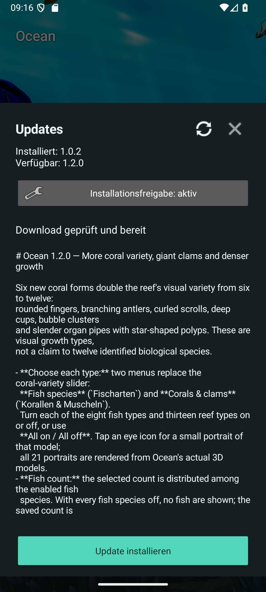
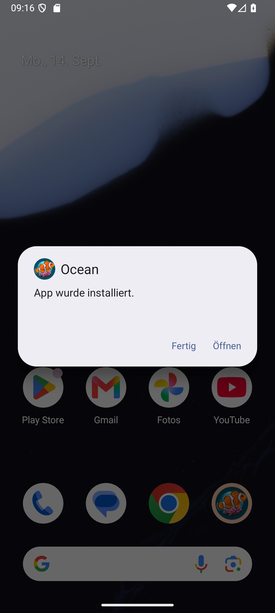
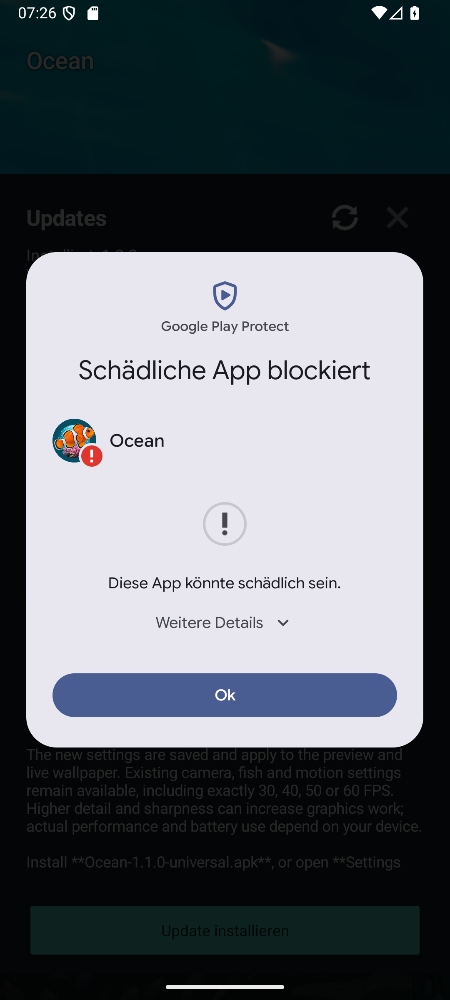
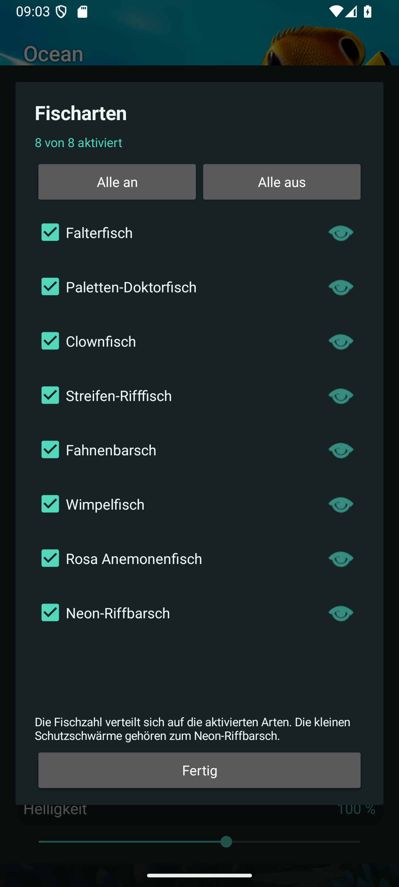
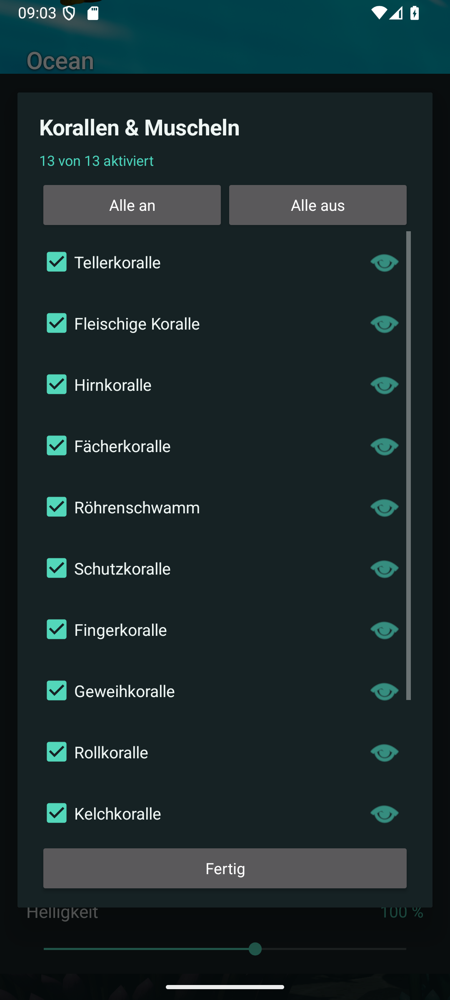
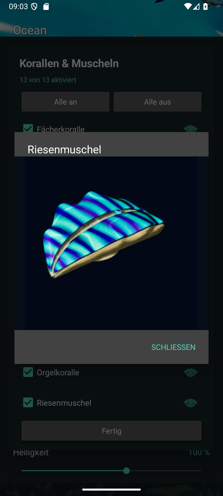

# Installing and Updating Ocean

Ocean is distributed as an APK through this repository, outside Google Play.
Download only from [Ocean Releases](https://github.com/ShakieVan/Ocean-LiveWallpaper/releases).
The universal APK works across the supported phone architectures.

## First Installation

1. Download the APK and open it from your browser or Downloads.
2. If Android requests permission for that source, open its **Settings** link.
   Enable **Allow from this source** only for the app that is opening the APK.
3. Return to the installer and read any security messages before continuing.
4. After installation, you can turn the source's installation permission off again.

Permission to install APKs and a Play Protect scan are separate checks. Granting
the first does not mean Google has approved the app.

## Updates Inside Ocean

1. Open **Settings > Updates** (`Einstellungen > Updates` in the current app).
2. Check the available version and release notes, then choose **Download update**.
3. Choose **Install update**. If needed, **Installation permission**
   (`Installationsfreigabe`) opens Android's settings specifically for Ocean.
4. Return to Ocean and start the installation. Android asks for confirmation.
5. On first opening after an update, Ocean offers a settings link if its
   installation permission is still active, so you can switch it off again.

For the first download, the permission belongs to your browser or file manager;
for an in-app update it belongs to Ocean. Turning off Ocean's permission does not
turn off your browser's permission.

## Google Play Protect

> [!NOTE]
> **Latest result: 1.2.0 installed successfully on September 14, 2026.** A fresh
> API-36 Android emulator initially had no Ocean installation. We installed
> **1.0.2 / version code 14** through ADB as the starting version, then used
> Ocean's public updater to find, download and verify **1.2.0**. Android's system
> installer completed that update. No scan or block dialog appeared; no override
> was used and no protection settings were changed. This observation applies to
> this emulator test, not your phone or a general Play Protect clearance.

The installed package reported **1.2.0 / version code 17**, with Android's system
package installer recorded as the installer. Ocean then opened successfully;
the checked crash log was empty. After Ocean's reminder, its permission to
install unknown apps was turned off again and confirmed disabled. These
unchanged screenshots show the update using the published release APK.

### Earlier Tests: 1.1.0 and 1.0.3

> [!WARNING]
> **1.1.0 was also blocked on September 14, 2026.** Ocean 1.0.2 found and
> downloaded the new release, and its file, package, version and signing checks
> passed. Android requested a Play Protect scan; after that scan it displayed
> "Harmful app blocked" and "This app might be harmful". The details did not
> identify a specific cause. We left the block in place; 1.0.2 remained installed.
> This is an emulator result, not a completed update or a test on your phone.

> [!NOTE]
> During our September 13, 2026 emulator test, Play Protect blocked **1.0.3**
> with `POTENTIALLY_UNWANTED / generic_malware`. The scan did not identify a
> specific file or behaviour. We have not established the cause or a false
> positive. An appeal was submitted on September 13, 2026, and Google confirmed
> receipt, but no decision has been communicated. Version 1.0.2 has almost identical
> code, so it should not be treated as an independently cleared alternative.

The unchanged 1.0.3 APK was uploaded to VirusTotal with the owner's consent.
Its [September 13 report](https://www.virustotal.com/gui/file/4591edc13eeb30c1aeaca974bb541c8e6b026a1593933678c6c7cd28ed3ab172)
showed **0/67 detections**, including Google "Undetected". Seven other engines
could not process the file type and one failed; those do not count as clean checks.
This is additional evidence, not an exhaustive security audit or confirmation that
on-device Play Protect has changed its result. The appeal included the scan result.
That report is for the exact 1.0.3 APK. It is not a scan of 1.1.0 or 1.2.0, and
no Play Protect clearance for either version is claimed here. The 1.1.0 block
above is a historical observation, not a new scan result for 1.2.0.

This is different from a message that merely says an app is unfamiliar or asks
to scan it. It is not known to be caused by small download numbers, a missing
registration or unpaid Google fees.

### Reading the Dialog

These are real screenshots from an Android emulator in German. Your phone's
wording and layout may differ.

- **More details** (`Weitere Details`) expands the explanation; it does not install.
- **OK** (`Ok`) closes the blocked-installation dialog without installing the update.
- The expanded panel may offer **Install anyway** (`Trotzdem installieren`).
  That overrides this installation block; it is not a successful security check
  or Google approval. The earlier blocked tests did **not** select it. We
  recommend leaving the block in place while the classification remains unresolved.

Do not disable Play Protect globally to install Ocean. If the dialog only asks
for a scan, let the scan finish and read its result; do not assume it will be
the same as a result on another device or version.

Google's [developer guidance](https://developers.google.com/android/play-protect/warning-dev-guidance)
describes the different messages and the [classification appeal process](https://support.google.com/googleplay/android-developer/contact/protectappeals).
Developer identity verification is a separate process, not automatic clearance
of a malware classification.

### File Integrity

The updater checks the GitHub asset digest, file size, application identity,
newer version and matching signing certificate before opening Android's installer.
For a manual download, each release includes `SHA256SUMS.txt`.
These checks establish identity and integrity, not that an APK is harmless.

## After Installation

Open Ocean, set your view, and tap **Set wallpaper**. Use Android's own picker
to select the destination offered by your phone. Keep installation permission
off when you do not need it; the wallpaper does not need it to run.

## Appearance Controls

Version 1.1.0 adds six controls in **Settings** (`Einstellungen`). The current
app uses the German labels shown below. Changes are saved for the preview and
live wallpaper.

| Control in the app | What it changes | Default |
| --- | --- | --- |
| **Oberflächendetails** — Surface detail | Basic / Fine / High / Maximum (`Basis / Fein / Hoch / Maximum`) adjust extra reef detail and fish scales. | High (`Hoch`) |
| **Texturschärfe** — Texture sharpness | 0–100% strengthens existing fine texture contrast on reef and fish. | Off (`Aus`) |
| **Helligkeit** — Brightness | 30–150%; below 100%, selected fluorescent coral colours stand out more. | 100% |
| **Kontrast** — Contrast | 50–150% adjusts image contrast. | 100% |
| **Wasserklarheit** — Water clarity | 0–100%; lower values shorten visibility through the water. Maximum (`Klar`) retains the previous clear view. | Clear, 100% |
| **Rifffarbe** — Reef colour | Limestone (`Kalk`) at 0%, dark grey (`Dunkelgrau`) at 50%, magma black (`Magma-Schwarz`) at 100%, with smooth transitions. Only the rocks change colour. | Limestone, 0% |

Try the defaults first, then adjust one control at a time. Use a lower surface
detail setting if you prefer less graphics work; device performance and battery
use vary. Texture sharpness is optional and does not add new objects. Magma black
is dark rock, not glowing lava.

The camera reset button resets the view while keeping these appearance choices.
Fish count, tilt strength, shadows and the 30/40/50/60 FPS options remain in
Settings. Android's wallpaper picker determines which screen destinations your
phone supports.

## Coral Variety and Extra Growth

Version **1.2.0** adds six original coral growth forms: fingers, branching
antlers, curled scrolls, cups, bubble clusters and organ pipes. Together with
the previous six forms, this doubles the reef's visual variety. These are
visual types, not a promise of twelve identified biological species.

Three giant clams join the reef as additional animals; they are not counted as
coral forms. Each has a ridged shell and a bright, striped mantle that pulses
subtly inside the opening. The new coral and clam geometry is original and uses
mapped surface detail.

Two menus in Settings replace the coral-variety slider:

- **Fish species** (`Fischarten`): switch each of eight fish types on or off.
- **Corals & clams** (`Korallen & Muscheln`): switch each of thirteen reef types
  on or off: the twelve visual coral forms and giant clams. Each of the six new
  coral forms has three colonies; the giant-clam switch controls three clams.

Both menus offer **All on / All off** (`Alle an / Alle aus`). The eye icon
beside each switch opens a small model portrait without changing the selection.
All 21 portraits were rendered from the actual models used by Ocean, so you can
identify a type before choosing it. Scroll the coral list to see all thirteen
entries. Choose **Close** (`Schließen`) to return from a portrait and **Done**
(`Fertig`) to close the species menu.

These unchanged screenshots show the German menus and the giant-clam portrait
in Ocean 1.2.0 on an Android emulator. Your phone's layout may differ.

The **Fish count** setting is distributed across the enabled fish species.
If all fish species are off, no fish are shown; the saved count returns when you
enable a species. The little shelter schools belong to the neon reef fish and
appear only while that fish type and their branching shelter coral are enabled.

All types are enabled by default. If a coral-variety level was previously saved,
it becomes the corresponding individual selection: the original six types stay
enabled and the previously selected additions stay selected. For example, an
old **Double** selection retains twelve coral forms with giant clams off.

**Extra growth** (`Zusatzbewuchs`) keeps its 0–100% range and now adds twice as
many colonies at each enabled step. These totals apply with all coral types on:

| Slider | Previous releases | Version 1.2.0 |
| --- | ---: | ---: |
| 0% | 0 | 0 |
| 25% | 8 | 16 |
| 50% | 16 | 32 |
| 75% | 24 | 48 |
| 100% | 31 | 62 |

Disabling a coral type also removes that type from additional growth, so fewer
colonies may be shown than the totals above. The original reef placements stay
in place. Species choices and growth apply to the preview and live wallpaper
and are preserved by camera reset. Fewer enabled reef types or less extra growth
draw fewer objects; actual performance and battery use depend on your device.
Existing texture sharpness and brightness-dependent fluorescence also apply to
the new mapped coral surfaces.
