# Installing and Updating Ocean

Ocean is distributed as an APK through this repository, outside Google Play.
Download only from [Ocean Releases](https://github.com/ShakieVan/Ocean-LiveWallpaper/releases).
The universal APK works across the supported phone architectures.

## First Installation

1. Download the APK and open it from your browser or Downloads.
2. If Android requests permission for that source, open its **Settings** link.
   Enable **Allow from this source** only for the app that is opening the APK.
3. Return to the installer and read any security messages before continuing.
4. After installation, you can turn the source's installation permission off again.

Permission to install APKs and a Play Protect scan are separate checks. Granting
the first does not mean Google has approved the app.

## Updates Inside Ocean

1. Open **Settings > Updates** (`Einstellungen > Updates` in the current app).
2. Check the available version and release notes, then choose **Download update**.
3. Choose **Install update**. If needed, **Installation permission**
   (`Installationsfreigabe`) opens Android's settings specifically for Ocean.
4. Return to Ocean and start the installation. Android asks for confirmation.
5. On first opening after an update, Ocean offers a settings link if its
   installation permission is still active, so you can switch it off again.

For the first download, the permission belongs to your browser or file manager;
for an in-app update it belongs to Ocean. Turning off Ocean's permission does not
turn off your browser's permission.

## Google Play Protect

### Latest successful update: 1.5.0

On September 15, 2026, a fresh API-36 emulator received original **1.4.2**
as its starting version. Ocean found public **1.5.0 / code 23**, displayed its
release notes, downloaded and verified the APK, then Android's system installer
completed the update. Ocean reopened with an empty crash log. No scan or block
dialog appeared, and Ocean's temporary installation permission was switched
off afterward. Only the starting APK used ADB. This emulator result does not
establish phone behavior or general Play Protect clearance. The published
137,182,038-byte APK has not been replaced; SHA-256:
`17df0da432e5f3e20198e385f2a227a31a03c4d70de7f63f06746e970e60440f`.

### Earlier successful update: 1.4.1

On September 15, 2026, a fresh API-36 emulator received original 1.4.0
as the starting version, then updated to **1.4.1 / code 21** through Ocean's
public updater and Android's system installer. The download was verified,
installation succeeded and Ocean reopened with an empty crash log. No scan or
block dialog appeared. Ocean's installation permission was switched off again.
This is an emulator result, not phone testing or general Play Protect clearance.

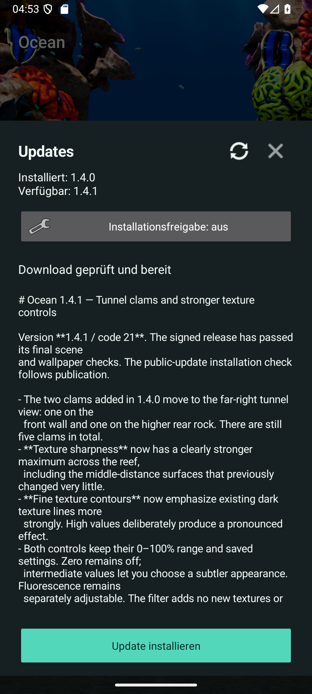

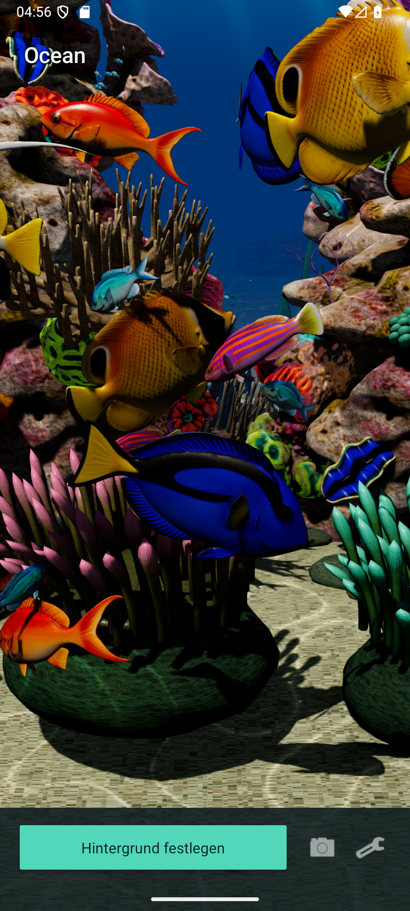

Only the starting APK used ADB. Android recorded
`com.google.android.packageinstaller` as the installer of the update.
The published APK is unchanged: **130,816,783 bytes**, SHA-256
`cbc7e7f82ecff59c8abe63498ac0085c74a477ef85f96810e33be36282d23e28`.

### Earlier successful update: 1.4.0

On September 15, 2026, a fresh API-36 emulator received original 1.3.0
as its starting version, then updated to **1.4.0 / code 20** through Ocean's
public updater and Android's system installer. Download verification succeeded;
no scan or block dialog appeared. Ocean reopened successfully, its crash log
was empty, and its temporary installation permission was switched off again.
This is an emulator result, not phone testing or general Play Protect clearance.

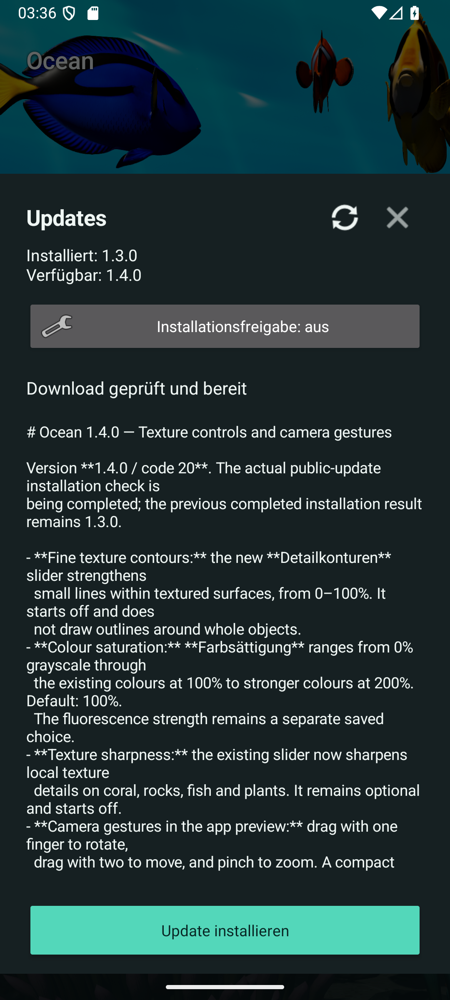

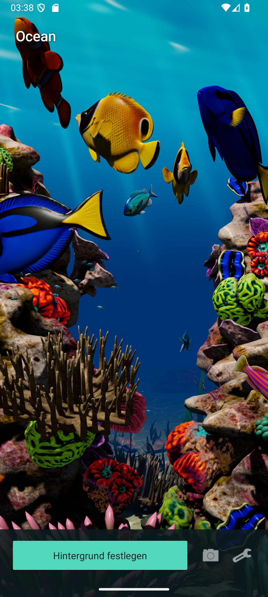

Only the original starting APK used ADB. Android recorded
`com.google.android.packageinstaller` as the installer of 1.4.0.
The published 130,816,783-byte APK has not been replaced.

### Earlier successful update: 1.3.0

> [!NOTE]
> **Earlier result: 1.3.0 installed successfully on September 14, 2026.** A fresh
> API-36 Android emulator initially had no Ocean installation. We installed
> **1.2.1 / version code 18** through ADB as the starting version, then used
> Ocean's public updater to find, download and verify **1.3.0**. Android's system
> installer completed that update. No scan or block dialog appeared; no override
> was used and no global protection settings were changed. This observation applies to
> this emulator test, not your phone or a general Play Protect clearance.

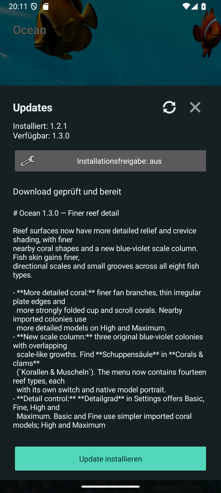
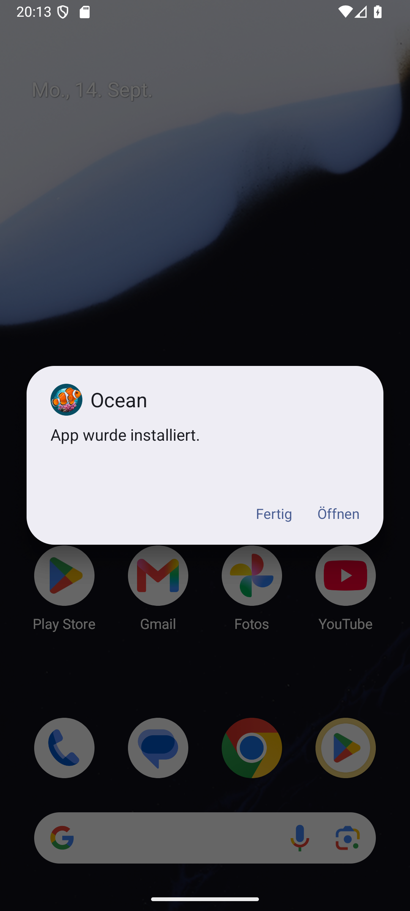
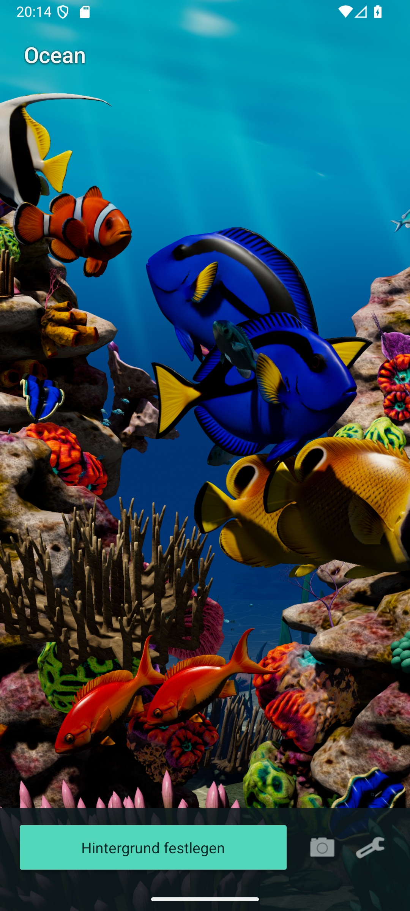

Android displayed **App installed** (`App wurde installiert.`). The package
reported **1.3.0 / version code 19**, with `com.google.android.packageinstaller`
recorded as the installer. Only the starting version used ADB; the 1.3.0 update
was downloaded through Ocean and installed through Android's confirmation flow.
Ocean then showed its installation-permission reminder, and that permission
was switched off again and confirmed disabled. The updated app opened
successfully, and the checked crash log was empty. These unchanged screenshots
show the published release APK, not a replacement build.

The earlier **1.2.0 to 1.2.1** update also succeeded through the same public
updater and system installer. Its original screenshots remain available:
[verified download](media/update-1.2.1-verified.png),
[installed](media/update-1.2.1-installed.png), [running app](media/update-1.2.1-main.png).

### Earlier Successful Update: 1.2.0

An earlier fresh API-36 emulator, also initially without Ocean, received
**1.0.2 / version code 14** as its starting version through ADB. Ocean's public
updater then downloaded and verified **1.2.0**, and Android installed it
successfully on September 14, 2026. No scan or block dialog appeared, no override
was used and no global protection settings were changed.

The installed package reported **1.2.0 / version code 17**, with Android's system
package installer recorded as the installer. Ocean then opened successfully;
the checked crash log was empty. After Ocean's reminder, its permission to
install unknown apps was turned off again and confirmed disabled. These
unchanged screenshots show the update using the published release APK.

### Earlier Tests: 1.1.0 and 1.0.3

> [!WARNING]
> **1.1.0 was also blocked on September 14, 2026.** Ocean 1.0.2 found and
> downloaded the new release, and its file, package, version and signing checks
> passed. Android requested a Play Protect scan; after that scan it displayed
> "Harmful app blocked" and "This app might be harmful". The details did not
> identify a specific cause. We left the block in place; 1.0.2 remained installed.
> This is an emulator result, not a completed update or a test on your phone.

> [!NOTE]
> During our September 13, 2026 emulator test, Play Protect blocked **1.0.3**
> with `POTENTIALLY_UNWANTED / generic_malware`. The scan did not identify a
> specific file or behaviour. We have not established the cause or a false
> positive. An appeal was submitted on September 13, 2026, and Google confirmed
> receipt, but no decision has been communicated. Version 1.0.2 has almost identical
> code, so it should not be treated as an independently cleared alternative.

The unchanged 1.0.3 APK was uploaded to VirusTotal with the owner's consent.
Its [September 13 report](https://www.virustotal.com/gui/file/4591edc13eeb30c1aeaca974bb541c8e6b026a1593933678c6c7cd28ed3ab172)
showed **0/67 detections**, including Google "Undetected". Seven other engines
could not process the file type and one failed; those do not count as clean checks.
This is additional evidence, not an exhaustive security audit or confirmation that
on-device Play Protect has changed its result. The appeal included the scan result.
That report is for the exact 1.0.3 APK. It is not a scan of 1.1.0, 1.2.0 or 1.2.1,
and no general Play Protect clearance for those versions is claimed here. The
1.1.0 block above is a historical observation, not a new scan result for 1.2.1.

This is different from a message that merely says an app is unfamiliar or asks
to scan it. It is not known to be caused by small download numbers, a missing
registration or unpaid Google fees.

### Reading the Dialog

These are real screenshots from an Android emulator in German. Your phone's
wording and layout may differ.

- **More details** (`Weitere Details`) expands the explanation; it does not install.
- **OK** (`Ok`) closes the blocked-installation dialog without installing the update.
- The expanded panel may offer **Install anyway** (`Trotzdem installieren`).
  That overrides this installation block; it is not a successful security check
  or Google approval. The earlier blocked tests did **not** select it. We
  recommend leaving the block in place while the classification remains unresolved.

Do not disable Play Protect globally to install Ocean. If the dialog only asks
for a scan, let the scan finish and read its result; do not assume it will be
the same as a result on another device or version.

Google's [developer guidance](https://developers.google.com/android/play-protect/warning-dev-guidance)
describes the different messages and the [classification appeal process](https://support.google.com/googleplay/android-developer/contact/protectappeals).
Developer identity verification is a separate process, not automatic clearance
of a malware classification.

### File Integrity

The updater checks the GitHub asset digest, file size, application identity,
newer version and matching signing certificate before opening Android's installer.
For a manual download, each release includes `SHA256SUMS.txt`.
These checks establish identity and integrity, not that an APK is harmless.

## After Installation

Open Ocean, set your view, and tap **Set wallpaper**. Use Android's own picker
to select the destination offered by your phone. Keep installation permission
off when you do not need it; the wallpaper does not need it to run.

## Appearance Controls

Version **1.4.0** expands the seven appearance controls from 1.3.0 to
**nine** in **Settings** (`Einstellungen`). Its new controls have passed the
first emulator checks; the final release is still in preparation. The German
labels appear below. Changes are saved for the preview and live wallpaper.
The older screenshot retains its 1.2.1 version and does not show the two additions.

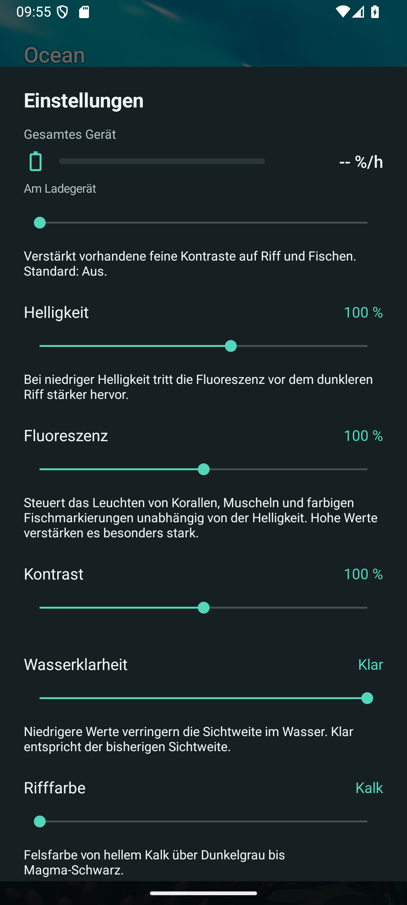

| Control in the app | What it changes | Default |
| --- | --- | --- |
| **Detailgrad** — Detail level | Basic / Fine / High / Maximum (`Basis / Fein / Hoch / Maximum`) adjust reef relief and fish scales. Basic and Fine use simpler imported coral models; High and Maximum show finer shapes. | High (`Hoch`) |
| **Texturschärfe** — Texture sharpness | 0–100% strengthens local texture details on reef, fish and plants. Version 1.4.1 makes its maximum noticeably stronger. | Off (`Aus`) |
| **Detailkonturen** — Fine texture contours | New in 1.4.0: 0–100% strengthens fine existing lines inside textures, without outlining whole objects. | Off (`Aus`) |
| **Helligkeit** — Brightness | 30–150%; lower values dim the surroundings while fluorescent colours stand out more. | 100% |
| **Fluoreszenz** — Fluorescence | 0–200%, independent of brightness: off / normal at 100% / exaggerated at 200%. Controls selected coral colours, the blue clam band and artistic fish and nursery markings. | 100% |
| **Kontrast** — Contrast | 50–150% adjusts image contrast. | 100% |
| **Farbsättigung** — Colour saturation | New in 1.4.0: 0% grayscale, 100% the existing colours, 200% stronger colours. This also affects the displayed fluorescent colours while preserving the separate fluorescence setting. | 100% |
| **Wasserklarheit** — Water clarity | 0–100%; lower values shorten visibility through the water. Maximum (`Klar`) retains the previous clear view. | Clear, 100% |
| **Rifffarbe** — Reef colour | Limestone (`Kalk`) at 0%, dark grey (`Dunkelgrau`) at 50%, magma black (`Magma-Schwarz`) at 100%, with smooth transitions. Only the rocks change colour. | Limestone, 0% |

Try the defaults first, then adjust one control at a time. Use a lower surface
detail setting if you prefer less graphics work; device performance and battery
use vary. Texture sharpness and fine contours are optional and do not add new objects. Magma black
is dark rock, not glowing lava.

Fluorescent fish patterns are artistic body lines, spots and tail accents;
their placement does not claim scientifically documented fluorescence in each
depicted species. The markings follow the existing mapped colours and animation.

The camera reset button resets the view while keeping these appearance choices.
Fish count, tilt strength, shadows and the 30/40/50/60 FPS options remain in
Settings. Android's wallpaper picker determines which screen destinations your
phone supports.

## Camera Gestures

Version **1.4.0** supports gestures directly in the app preview:

- Drag one finger to rotate the view.
- Drag two fingers together to move the view.
- Move two fingers apart or together to zoom.

After lifting one finger from a two-finger gesture, lift the remaining finger
before starting a new rotation. A small tap still triggers the little shelter
schools' response. Since 1.5.1, the **Refresh** icon beside **Set wallpaper**
chooses another prepared coral layout. Open **Settings > Camera**
(`Einstellungen > Kamera einstellen`) for camera reset and advanced sliders.
Those fine controls remain available for precise adjustments.

In 1.5.0, camera edits stay in the app until you confirm **Set wallpaper** in
Android's system picker. The picker shows your edited view. Canceling keeps
the active wallpaper's prior camera angle; returning to Ocean retains your
unsaved draft for another attempt. Reset changes only the draft camera. The
coral menu's **Redistribute corals** button picks another of four prepared,
balanced layouts. Since **1.6.0**, all 231 regular reef colonies participate,
including large foreground corals, all five clams and optional extra growth.
Only occupied fish shelters remain fixed. All nine Acanthastrea colour variants
stay represented in each reef region. Species and growth controls still decide
which colonies are visible.

Drag and pinch gestures belong to the app preview; the wallpaper retains its
existing tap response and leaves the launcher's gestures in place.

## Coral Variety and Extra Growth

Version **1.2.0** adds six original coral growth forms: fingers, branching
antlers, curled scrolls, cups, bubble clusters and organ pipes. Together with
the previous six forms, this doubles the reef's visual variety. These are
visual types, not a promise of twelve identified biological species.

Three giant clams join the reef as additional animals; they are not counted as
coral forms. In **1.2.1**, their Maxima-style mantle has a deeply folded opening
and a cobalt-blue longitudinal band inside a thick pale shell lip. Its blue
band responds to the fluorescence slider. The mantle moves subtly; the shell
stays rigid. The original coral and clam geometry uses mapped surface detail.

Two menus in Settings replace the coral-variety slider:

Version **1.3.0** adds three blue-violet **scale columns** (`Schuppensäule`),
with many overlapping scale-like growths, and refines fan branches, plate edges
and folded cups. The name describes an original visual form, not a biological
species identification.

Version **1.4.0** refines existing forms with three broad turquoise-orange
solitary discs, three thin brown-beige coral terraces and slimmer scale columns.
It keeps the same fourteen reef types, eight fish types and 22 model portraits.
Two additional giant clams bring the total to **five**, sitting on existing rock
toward the right foreground and farther back at a higher position. The older
images predate these changes.

- **Fish species** (`Fischarten`): switch each of eight fish types on or off.
- **Corals & clams** (`Korallen & Muscheln`): switch each of fourteen reef types
  on or off, including the new scale column and giant clams. Each of the six earlier
  coral forms has three colonies. The giant-clam switch controls all clams:
  three in 1.3.0 and five since 1.4.0.

Both menus offer **All on / All off** (`Alle an / Alle aus`). The eye icon
beside each switch opens a small model portrait without changing the selection.
All 22 portraits are rendered from the actual models used by Ocean, so you can
identify a type before choosing it. Scroll the coral list to see all fourteen
entries. Choose **Close** (`Schließen`) to return from a portrait and **Done**
(`Fertig`) to close the species menu.

Updating preserves individual exclusions. The 1.3.0 update automatically enabled
the new scale column only when every previously available reef type was enabled.
You can switch it off independently, and that choice is saved. Version 1.4.0
keeps the same catalog and retains the existing selections.

These unchanged screenshots show the German menus and the giant-clam portrait
in Ocean 1.2.0 on an Android emulator. Your phone's layout may differ.

The updated Maxima-style clam in **1.2.1** has its own new model portrait:

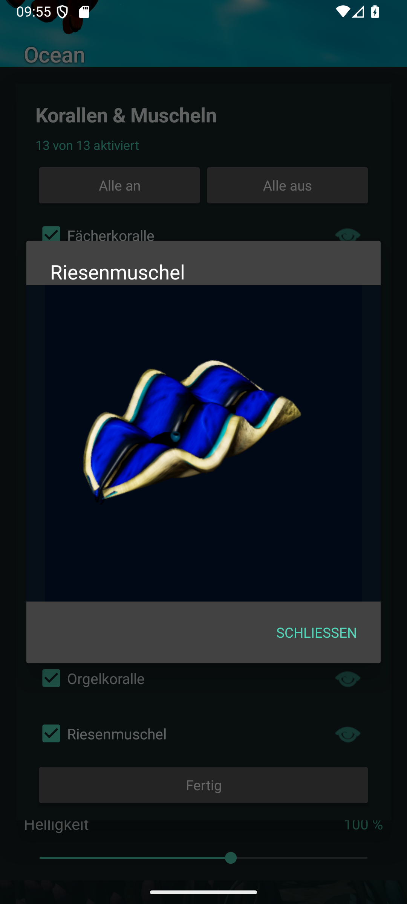

The **Fish count** setting is distributed across the enabled fish species.
If all fish species are off, no fish are shown; the saved count returns when you
enable a species. The little shelter schools belong to the neon reef fish and
appear only while that fish type and their branching shelter coral are enabled.

All types are enabled by default. If a coral-variety level was previously saved,
it becomes the corresponding individual selection: the original six types stay
enabled and the previously selected additions stay selected. For example, an
old **Double** selection retains twelve coral forms with giant clams off.

**Extra growth** (`Zusatzbewuchs`) keeps its 0–100% range and now adds twice as
many colonies at each enabled step. These totals apply with all coral types on:

| Slider | Previous releases | Version 1.2.0 |
| --- | ---: | ---: |
| 0% | 0 | 0 |
| 25% | 8 | 16 |
| 50% | 16 | 32 |
| 75% | 24 | 48 |
| 100% | 31 | 62 |

Disabling a coral type also removes that type from additional growth, so fewer
colonies may be shown than the totals above. Species choices and growth apply to the preview and live wallpaper
and are preserved by camera reset. Fewer enabled reef types or less extra growth
draw fewer objects; actual performance and battery use depend on your device.
Existing texture sharpness and the selected fluorescence strength also apply to
the new mapped coral surfaces.

## Updated coral portraits in 1.4.0

These native model portraits show the revised solitary disc, thin terraces and
slender scale column; each retains its existing individual species switch.

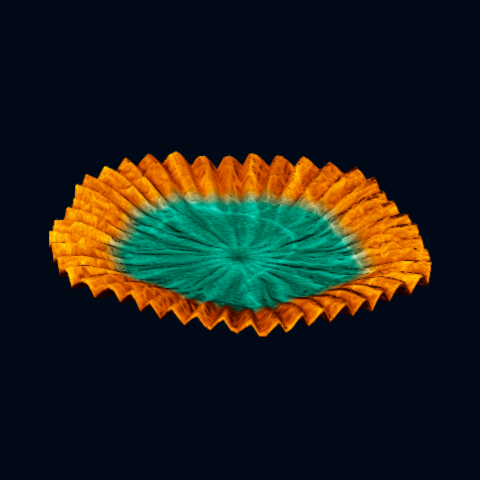
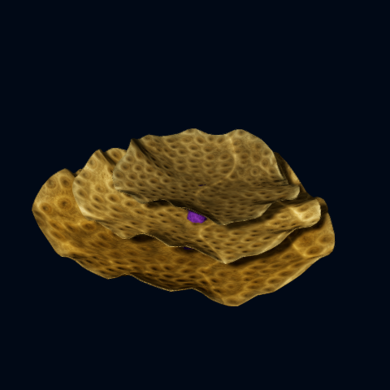
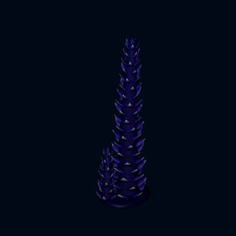

## Texture comparison in 1.4.1

The two clams added in 1.4.0 have moved to the front wall and higher rear rock
of the far-right tunnel view. The original three remain in place.

These are unchanged native Android captures using the same camera and scene.
Fish are disabled and lighting is frozen for this comparison. Both controls
are off in the first image; the second sets only texture sharpness to 100%,
and the third sets only fine contours to 100%. Other settings stay unchanged.
Maximum is deliberately strong; intermediate values provide a subtler result.

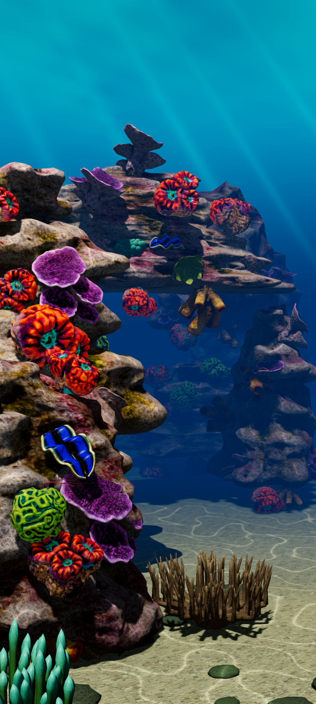
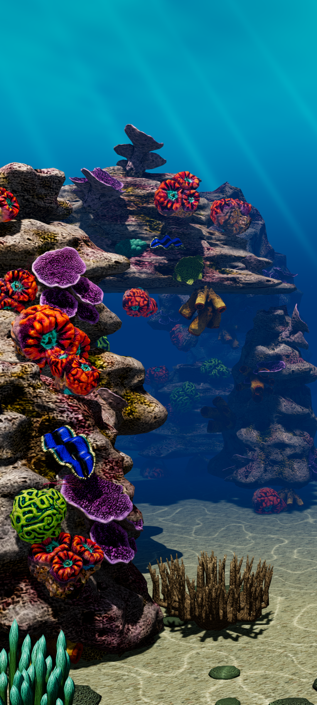
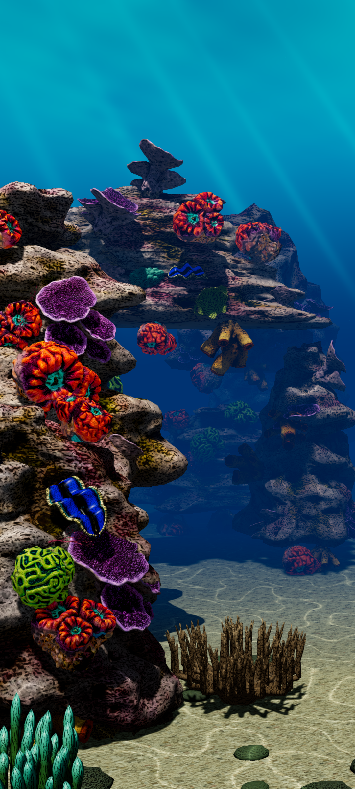
