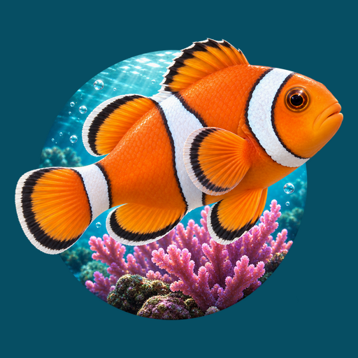
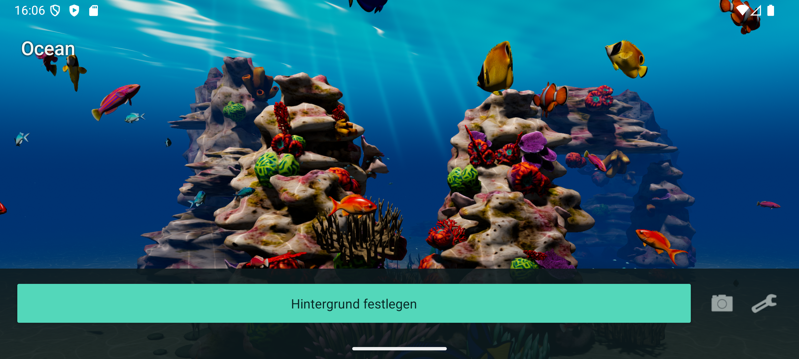

# Ocean

**A living coral reef for your Android home screen.**

Tropical fish, sunlit water and a coral canyon that moves with your perspective.
Ocean is a real-time 3D live wallpaper, not a looping video.

**[Watch on YouTube](https://www.youtube.com/shorts/x7QC6oZ9l2A)**
| [Portrait screenshot](media/ocean-portrait.png)
| [Download the preview MP4](https://github.com/ShakieVan/Ocean-LiveWallpaper/releases/download/v1.0.3/Ocean-preview-en.mp4)

> [!NOTE]
> **Latest installation result:** On September 15, 2026, a fresh API-36 Android
> emulator successfully updated from **1.3.0 to 1.4.0** through Ocean's public
> updater and Android's system installer. Download and integrity checks passed;
> no scan or block dialog appeared, and no Play Protect override or global
> protection change was used.
> This is an emulator result, not a phone test or general Play Protect clearance.
> Earlier fresh-emulator updates from **1.0.2 to 1.2.0** and **1.2.0 to 1.2.1** also succeeded.
> Earlier tests blocked **1.1.0** after a requested scan on September 14 and
> **1.0.3** on September 13. An appeal for 1.0.3 was submitted on September 13, 2026;
> Google has not communicated a decision. A subsequent
> [VirusTotal scan reported 0/67 detections](https://www.virustotal.com/gui/file/4591edc13eeb30c1aeaca974bb541c8e6b026a1593933678c6c7cd28ed3ab172),
> which applies to that 1.0.3 file only and is not a safety guarantee or Play Protect
> clearance for any later version. The successful updates do not establish
> general Play Protect clearance for these versions.
> [See the screenshots and installation notes](INSTALLATION.md#google-play-protect).

**[Download Ocean for Android](https://github.com/ShakieVan/Ocean-LiveWallpaper/releases/latest)**
| [Installation & updates](INSTALLATION.md) | [Privacy](PRIVACY.md)

## Your Own Corner of the Reef

- Eight fish types with animated bodies and fins, plus small schools that
  retreat into their coral shelter when you tap nearby.
- Colourful coral, swaying plants, drifting particles and moving underwater light.
- Move, rotate and zoom the camera, then save your favourite perspective.
- New in **1.4.0**: fine texture contours, adjustable colour
  saturation and improved texture sharpness, plus one-finger rotation and
  two-finger pan/pinch in the app preview. Broad turquoise-orange discs, thin
  brown-beige coral terraces and slimmer scale columns refine existing types;
  five giant clams rest on the existing reef. [Release notes](releases/v1.4.0.md).
- New in **1.3.0**: finer coral shapes, stronger surface relief and finer fish
  scales, plus blue-violet scale columns. The **Detailgrad** control also
  selects simpler or more detailed coral models. **Corals & clams** now offers
  fourteen independently selectable reef types with model portraits.
  [Release notes](releases/v1.3.0.md).
- New in **1.2.1**: a deeply folded Maxima-style clam with a cobalt-blue glowing
  band, plus artistic fluorescent fish markings. The new **Fluorescence** slider
  controls corals, clams, fish and small schools independently of brightness:
  0% off, 100% normal, up to 200% for an exaggerated glow.
  [Release notes](releases/v1.2.1.md).
- New in **1.2.0**: six additional coral forms double the visual variety from
  six to twelve, joined by three giant clams with bright, striped mantles that
  pulse subtly within their shells. **Fish species** and **Corals & clams** menus
  introduced individual fish and coral switches, expanded to fourteen reef
  types in 1.3.0.
  Eye icons open small portraits rendered from the actual models.
  **Extra growth** adds twice as many colonies at every enabled step and follows
  your coral choices. Moving light rays reach farther sideways.
  [Choose species and adjust growth](INSTALLATION.md#coral-variety-and-extra-growth).
- Fine reef textures and fish scales, with controls for surface
  detail, texture sharpness, brightness, fluorescence, contrast, water clarity and reef colour.
  Lower brightness brings out the selected fluorescent colours; changing the
  rock from limestone to dark grey or magma black preserves coral colours.
  [Adjust the appearance](INSTALLATION.md#appearance-controls).
- Adjust fish count, swimming speed, extra vegetation, shadows and tilt strength.
- Choose exactly **30, 40, 50 or 60 FPS**. Rendering pauses when Android reports
  the wallpaper as invisible; actual power use depends on your device and settings.

## Getting Started

1. Read the installation note above and download the universal APK from Releases.
2. Install it with Android's system installer, then open **Ocean**.
3. Choose your camera angle and settings, then tap **Set wallpaper**.

Android supplies the home/lock-screen destination picker. Available combinations
depend on your phone and launcher. Android 9 or newer and OpenGL ES 3.0 are required.
Current app screenshots show the German interface; this download guide is in English.

Updates are available inside Ocean under **Settings > Updates**. This public
repository hosts the downloads used by the updater; development is maintained
separately. You do not need a GitHub account or access token to check for updates.

## Screenshots & Preview

The images and preview show the actual Android app running in an emulator.
They are not pre-rendered concept art or a phone performance benchmark.
The homepage scene image and video predate the 1.1.0 appearance controls and
1.2.0 reef additions. The installation guide includes newer 1.2.0 and 1.2.1
screenshots, plus the completed public 1.3.0 update. Existing media retain
their original version labels; final 1.4.0 images have not been added yet.
The short preview is silent, so you can add your own licensed soundtrack.

Feedback is welcome in [Issues](https://github.com/ShakieVan/Ocean-LiveWallpaper/issues).
Please include your phone model, Android version and Ocean version, but no private data.

[Third-party notices](THIRD_PARTY_NOTICES.md) | [License texts](licenses/)

Public downloads do not grant an open-source license to the application or its assets.
