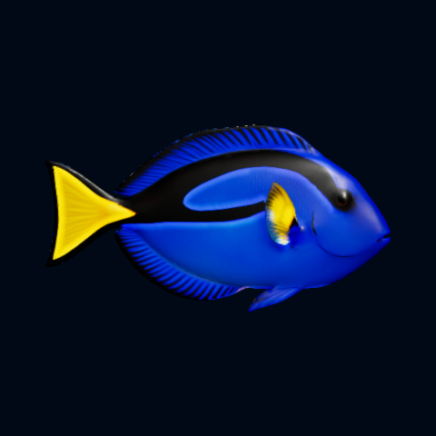
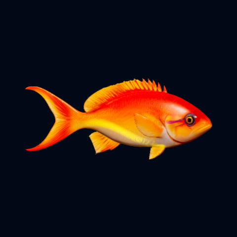
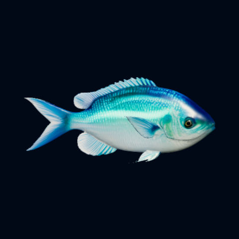
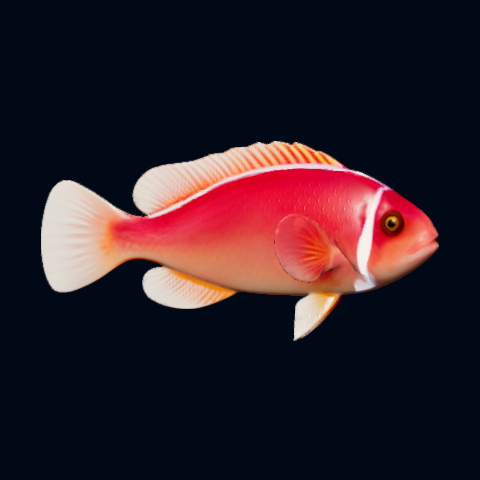

# Ocean 1.7.0 — Light that follows each fish's markings

Version **1.7.0 / code 26** brings the fluorescent accents closer to the actual
colour patterns of each fish.

- **Blue tang:** blue and yellow light follows the main borders against black.
  The edge stays sharp toward the black marking and fades softly into the
  coloured area. Smaller fin accents stay finer.
- **Butterflyfish, clownfish and bannerfish:** matching accents follow their
  existing main markings and fin edges.
- **Anthias:** the yellow area glows along its curved centre line, with a soft
  falloff on both sides.
- **Pink anemonefish:** the existing white back stripe and head/body band gain
  a subtle cool-blue glow.
- **Neon reef fish:** the turquoise area follows the same centre-line approach
  as the anthias, including the little shelter schools.
- **Striped reef fish:** its previous fluorescent pattern is retained.

Eyes are excluded. The Fluorescence slider keeps its 0–200% range: off, normal
at 100%, and an intentionally stronger effect at 200%. The light remains
concentrated in narrow structures. These are artistic accents, not a claim
about biological fluorescence.

## Native Android comparisons

These are unchanged 480 × 480 portraits from Ocean's actual Android renderer
on an API-36 emulator, using production fish geometry and materials under fixed
studio lighting. They are not the generated concept illustrations.

| Blue tang, fluorescence off | Blue tang, 100% |
| --- | --- |
|  |  |

| Anthias, 100% | Neon reef fish, 100% |
| --- | --- |
|  |  |

All eight species were checked from both sides at 0/100/200% in both detail
levels. Scene checks covered bright and dim lighting; lifecycle checks covered
reopening, changing surfaces and screen off/on. These emulator checks do not
measure phone performance or battery life.

## Update

Use **Settings > Updates** in Ocean, or download the universal APK from the
[1.7.0 release](https://github.com/ShakieVan/Ocean-LiveWallpaper/releases/tag/v1.7.0).
The existing signing identity is preserved for updates that retain app data.
The release includes a SHA-256 checksum and the existing asset/license notices.

On September 24, 2026, the complete **1.6.0 → 1.7.0** download, verification
and installation succeeded through Ocean and Android's installer on a fresh
API-36 emulator. The previously selected 30 FPS was retained; temporary install
permission was switched off afterward. No scan/block dialog or Ocean crash
was observed. This result is not a phone test or general Play Protect clearance.
